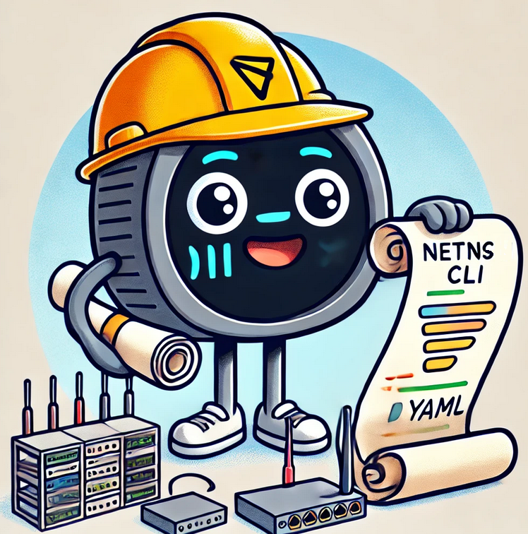

# netnscli

NetNSCLI is a lightweight Go-based CLI tool, built with Cobra, designed to create and manage local network testbeds effortlessly from YAML configurations.

**It is still a work in progress, and contributions are welcome!**

## Installation

To build the `netnscli` tool, use the following command:

```bash
make build
```

This will create the binary, which can be found in the `./bin` directory.

## Usage

Once built, you can use `netnscli` to create and manage your local network testbeds.

```bash
netncli

  _  _ ___ _____ _  _ ___  ___ _    ___ 
 | \| | __|_   _| \| / __|/ __| |  |_ _|
 | .  | _|  | | |  ' \__ \ (__| |__ | | 
 |_|\_|___| |_| |_|\_|___/\___|____|___|
                                        
netnscli creates and manages local network testbed

Usage:
  netnscli [flags]
  netnscli [command]

Available Commands:
  completion  Generate the autocompletion script for the specified shell
  create      Create a local network testbed
  delete      Delete a local network testbed
  help        Help about any command
  script      Script creates a script from a yaml configuration file for a local network testbed

Flags:
  -h, --help   help for netnscli

Use "netnscli [command] --help" for more information about a command.
```

### Example Commands

#### Create a Testbed

To create a network testbed from a YAML file:

```bash
sudo ./bin/netnscli create -f samples/yamls/test_ipv4_simple.yaml
```

To verify that the network namespace was created, use:

```bash
ip netns
```

Or to check the interface links in a specific namespace:

```bash
sudo ip netns exec ns1 ip link
```

#### Delete the Testbed

To delete the testbed, run:

```bash
sudo ./bin/netnscli delete -f samples/yamls/test_ipv4_simple.yaml
```

#### Generate a Script from YAML

If you can’t run `netnscli` on a node but have a well-structured YAML configuration file, you can use the `script` command to generate an equivalent shell script for setting up the testbed:

```bash
./bin/netnscli script -f samples/yamls/test_ipv4_simple.yaml
```

The generated script can be used locally to set up the testbed manually.

## Notes

This project started as an experiment to explore Go and the `netlink` and `netns` libraries, with the goal of creating a simpler, more structured way to create local testbeds for networking experiments. 

Planned features include adding macvlan support and more commands. If you're interested, check out the TODOs in the code.

## Logo




This logo was created using ChatGPT.
